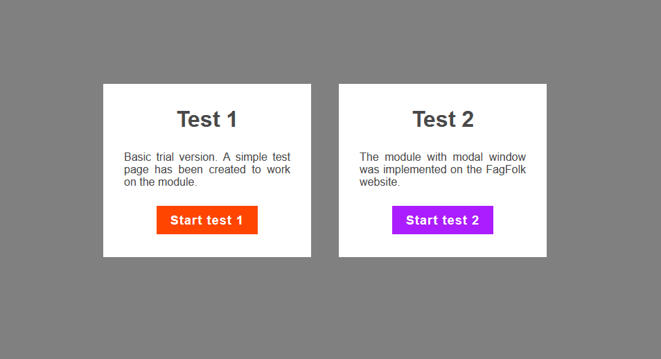
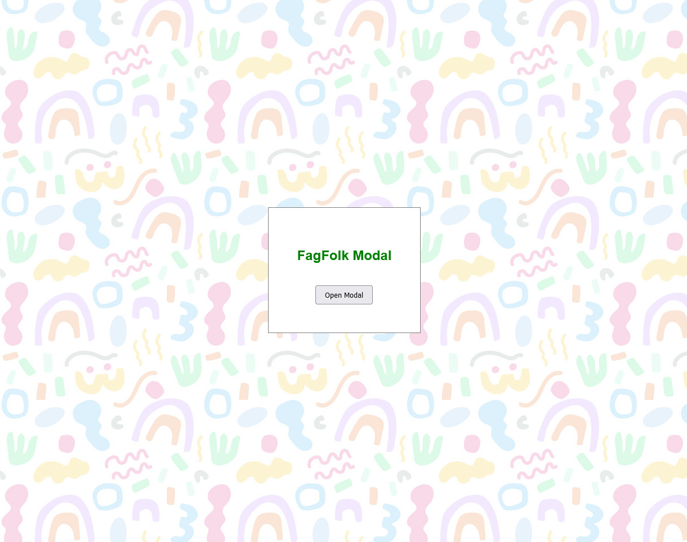
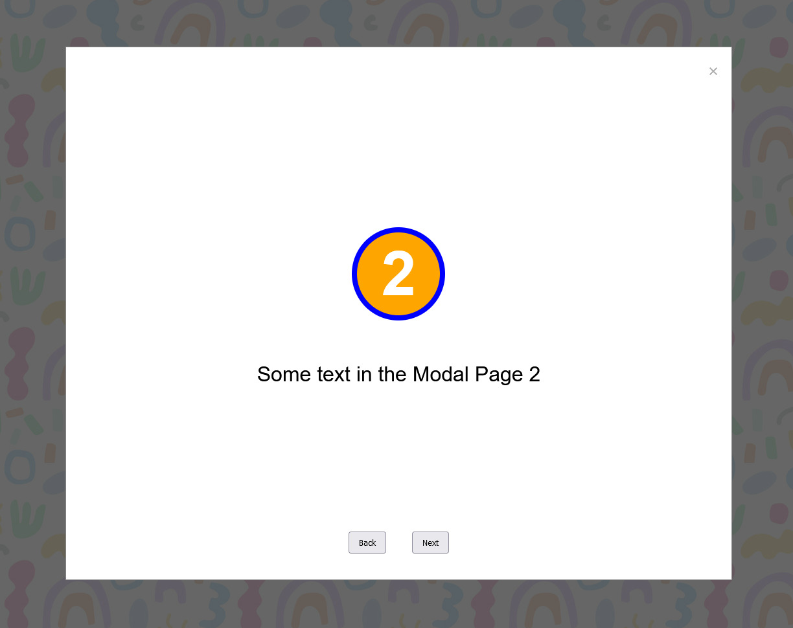
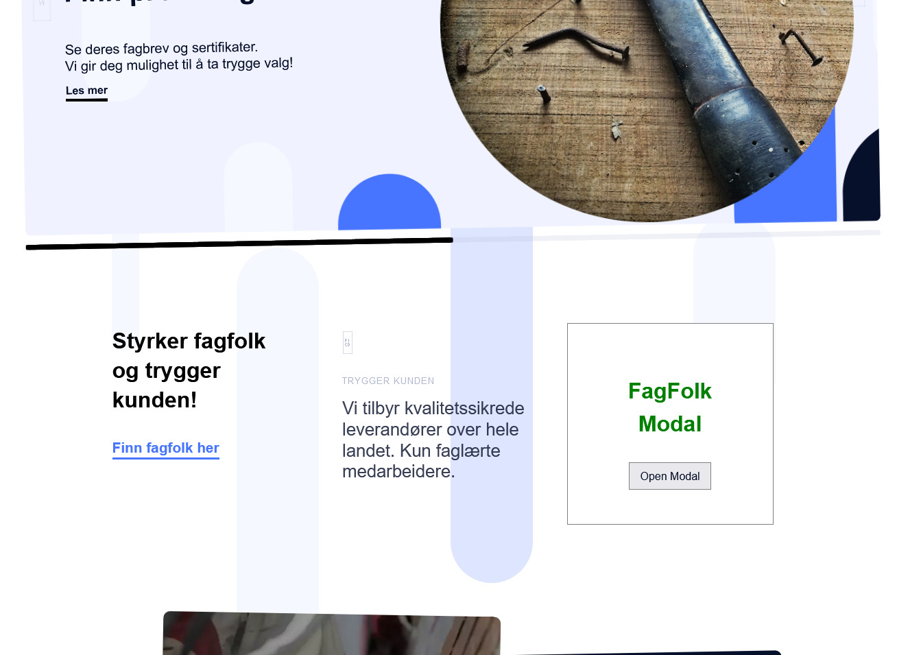
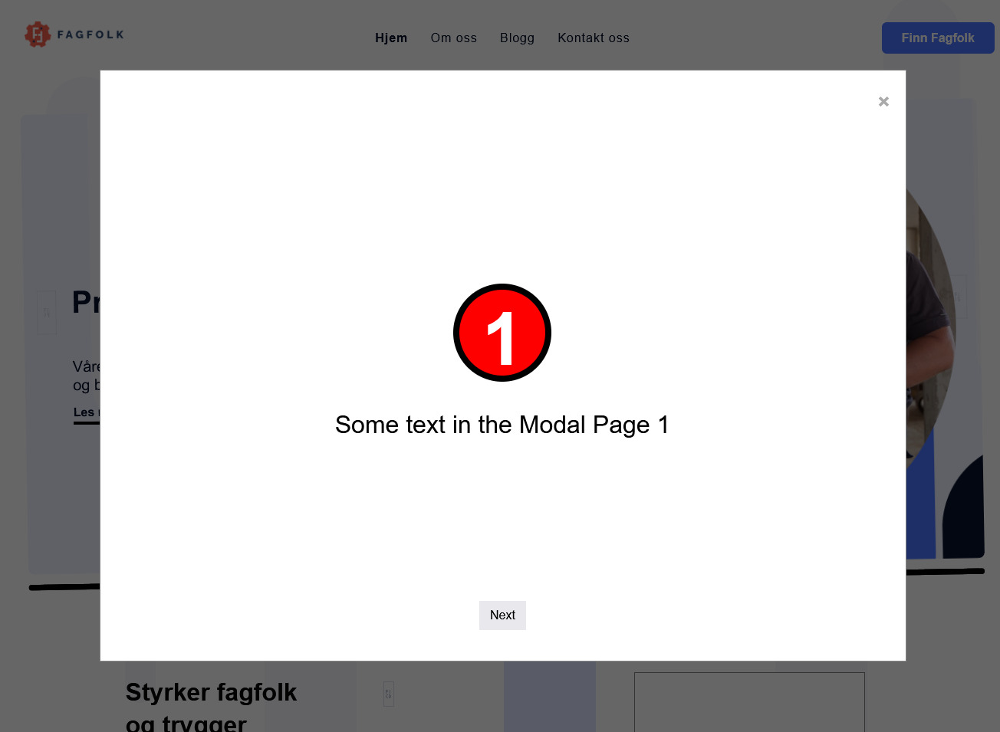

    <h1>Fagfolk Modal Window MVC</h1>
    <h3>
        <a href="https://chrisonoo.github.io/FagfolkModalWindowMVC/">
            Live demo
        </a>
         | 
        <a href="https://github.com/chrisonoo/FagfolkModalWindowMVC">
            GitHub
        </a>
    </h3>
    
Application supporting the acquisition of new customers

    
<b>Status:</b> Project completed

         
        
Technologies and tools:

    

        
        
        
        
        
        
        
        
        
    

 

## About project

The task I embarked on was to develop a module capable of opening in a modal window on any page where its code is inserted.

The paramount challenge lay in creating code that would be 100% unobtrusive for the systems in which the module will be implemented, thereby preventing any undesirable interference between the module and the generated page.

The module is designed to be fully compatible with the rest of the system and interfaces with the Firebase database for user registration and logging of construction project data.

## Test 1 - simple test page

## Test 2 - FagFolk.net page

## Project structure

<pre>
project/
├── fagfolk.net/
│   ├── index_files/ (page copy, just for test)
│   ├── server/ (files with modal window)
│   └── index.html
├── test-page/
│   ├── css/
│   ├── img/
│   ├── server/ (files with modal window)
│   └── test-page.html
└── index.html (start project)
</pre>

## Project notes

1. Files from the `server` folder are placed on the FagFolk server and downloaded when the page is loaded. After clicking on the banner on the page, the modal window view is generated from the JavaScript file.
2. All HTML and CSS is generated from the JavaScript file.
3. The test page presents the idea of how the entire project works, but does not yet implement all the mechanisms, nor the full design.
4. The full structure of the website is described in the attached document [download documentation](docs/Module-Code-Builder.pptx)

